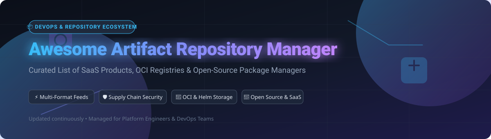

# 📦 Awesome Artifact Repository Manager

   

  

## 🚀 Overview & Ecosystem Summary

Welcome to the **Awesome Artifact Repository Manager** list! This repository is a curated, high-impact guide covering commercial **SaaS Artifact Platforms**, cloud-native **Package & Container Registries**, and **Open-Source Artifact Managers**. 

Artifact repository managers form the backbone of modern **DevOps Pipelines**, **CI/CD Workflows**, and **Software Supply Chain Security**. They act as centralized vaults to proxy, cache, version, scan, and distribute build outputs—including Maven JARs, npm packages, PyPI wheels, Docker/OCI container images, Helm charts, NuGet packages, and generic binary artifacts.

---

## 📑 Table of Contents
- [📊 Market Size & Industry Structure](#-market-size--industry-structure)
- [🏢 SaaS & Cloud-Hosted Platforms](#-saas--cloud-hosted-platforms)
- [🌟 Open-Source GitHub Projects](#-open-source-github-projects)
- [🎯 How to Choose an Artifact Repository Manager](#-how-to-choose-an-artifact-repository-manager)
- [❓ Frequently Asked Questions (FAQs)](#-frequently-asked-questions-faqs)
- [🤝 How to Contribute](#-how-to-contribute)
- [⚖️ Disclaimer & Security Notice](#%EF%B8%8F-disclaimer--security-notice)

---

## 📊 Market Size & Industry Structure

> 💡 **Market Size Estimate**: The global Artifact Repository & Package Registry market is valued at **~$2.8 Billion – $3.24 Billion (2025/2026)** and is projected to reach **~$6.5 Billion by 2030** at a Compound Annual Growth Rate (CAGR) of **~15.1%**.  
> 🏛️ **Sector Fragmentation & Structure**: The market is **moderately fragmented to concentrated**. Enterprise DevOps leaders (such as *JFrog* and *Sonatype*) alongside major Hyperscale Cloud Providers (*Microsoft Azure/GitHub*, *Google Cloud*, and *AWS*) hold dominant market share for universal enterprise feeds. However, the sector leaves substantial room for lightweight, open-source, and format-specific registries (e.g., *Harbor*, *Verdaccio*, *Gitea*) that power self-hosted and cloud-native Kubernetes environments.

---

## 🏢 SaaS & Cloud-Hosted Platforms

Below is a detailed comparison of leading commercial SaaS artifact repository platforms and cloud package registries, sorted by **Company Scale / Valuation (Descending)**.

| 🏢 Product / Provider | 📋 Key Description & Capabilities | 💰 Company Scale / Valuation | 💵 Specific Starting Paid Tier Price | 🎁 Specific Free Tier Limit / Trial |
| :--- | :--- | :--- | :--- | :--- |
| **[Azure Artifacts (Microsoft)](https://azure.microsoft.com/services/devops/artifacts/)** | Integrated universal package management for Azure DevOps; supports Maven, npm, PyPI, NuGet, and Universal Packages. | **~$3.1 Trillion** *(Microsoft Market Cap)* | **$2.00 / GB-month** *(beyond initial free quota)* | **Free Forever**: First 2 GiB storage free per organization forever |
| **[GitHub Packages (Microsoft)](https://github.com/features/packages)** | Cloud artifact hosting integrated natively into GitHub repositories and Actions; supports Docker/OCI, npm, Apache Maven, Gradle, NuGet, and RubyGems. | **~$3.1 Trillion** *(Microsoft Market Cap)* | **$0.008 / GB-day** (~$0.25/GB-mo) + **$0.50 / GB** data transfer | **Free Forever**: 500 MB storage & 1 GB data transfer/month free on GitHub Free plan |
| **[Google Artifact Registry (Google / Alphabet)](https://cloud.google.com/artifact-registry)** | Fully managed cloud-native registry supporting OCI container images, Helm, npm, PyPI, Java Maven, Go, and Debian/RPM OS packages. | **~$2.2 Trillion** *(Alphabet Market Cap)* | **$0.10 / GB-month** storage + standard egress network rates (~$0.08–$0.12/GB) | **Free Forever**: 0.5 GB (500 MB) storage free per month forever |
| **[AWS CodeArtifact (Amazon Web Services)](https://aws.amazon.com/codeartifact/)** | Scalable, pay-as-you-go artifact repository for npm, PyPI, Maven, Gradle, NuGet, and Swift packages with IAM policy security. | **~$2.0 Trillion** *(Amazon Market Cap)* | **$0.05 / GB-month** storage + **$0.05 per 10,000 requests** | **Free Forever**: 2 GB storage/month & 100,000 requests/month free via AWS Free Tier |
| **[JFrog Artifactory (JFrog Cloud)](https://jfrog.com/artifactory/)** | Industry-standard universal artifact repository supporting 30+ package formats, enterprise promotion pipelines, metadata indexing, and binary security (Xray). | **~$3.5 Billion** *(Publicly Traded NASDAQ: FROG)* | **$98.00 / month** *(Cloud Pro Pay-As-You-Go starting tier)* | **Free Forever**: 2 GB storage/month + 10 GB transfer/month + 2,000 CI build minutes/mo |
| **[Sonatype Nexus Repository Pro (Sonatype)](https://www.sonatype.com/products/nexus-repository)** | Enterprise artifact management platform providing policy enforcement, component intelligence, and governance across multi-language enterprise builds. | **~$1.5 Billion** *(Private Equity / Vista Equity)* | **$120.00 / user / year** (~$10.00/user/mo) for Nexus Pro | **14-Day Free Trial** for Pro edition *(or unlimited free self-hosted Nexus OSS edition)* |
| **[Cloudsmith](https://cloudsmith.com/)** | Cloud-native multi-format package management platform offering continuous packaging, security scanning, vulnerability detection, and worldwide CDN edge caching. | **~$100 Million** *(Series A/B venture backed)* | **$99.00 / month** *(Cloudsmith Core Plan includes 100 GB storage & 200 GB transfer)* | **14-Day Free Trial** with full enterprise feature access *(Free plans for verified Open Source)* |
| **[Inedo ProGet](https://inedo.com/proget)** | Universal package server designed for enterprise governance, vulnerability scanning, feed promotion pipelines, and self-hosted/cloud feeds. | **~$30 Million** *(Bootstrapped Enterprise Vendor)* | **$1,200.00 / year** (~$100.00/mo) for ProGet Basic Enterprise package | **Free Edition Forever**: Supports up to 5 package feeds with basic security capabilities |
| **[Packagecloud](https://packagecloud.io/)** | Cloud-hosted unified repository manager for Debian, RPM, Gem, PyPI, and npm packages with automated deployment scripts and webhooks. | **~$20 Million** *(Private / Specialized Host)* | **$49.00 / month** *(Basic Plan with 10 GB storage & 50 GB transfer)* | **14-Day Free Trial** with 10 GB storage and 50 GB data transfer quota |
| **[Gemfury](https://gemfury.com/)** | Private package registry hosting RubyGems, npm, PyPI, Composer, NuGet, and Debian packages with simple CLI workflows. | **~$10 Million** *(Independent Bootstrapped)* | **$9.00 / month** *(Collaborator plan for team access)* | **Free Forever**: 1 user account with unlimited public packages & 1 private package feed |

---

## 🌟 Open-Source GitHub Projects

Below is a curated list of top open-source artifact repositories, package servers, and OCI image registries, sorted by **GitHub Star Count (Descending)**.

| 📦 Project Name | 📜 Description & Supported Formats | 🌟 GitHub Stars Badge |
| :--- | :--- | :--- |
| **[Gitea](https://github.com/go-gitea/gitea)** | Lightweight all-in-one DevOps forge featuring built-in package registries for Docker/OCI, npm, PyPI, Maven, NuGet, Cargo, Helm, and Composer. |  |
| **[Harbor](https://github.com/goharbor/harbor)** | CNCF Graduated enterprise cloud-native OCI registry securing artifacts with RBAC, vulnerability scanning (Trivy), image signing (Cosign/Notary), and multi-datacenter replication. |  |
| **[Verdaccio](https://github.com/verdaccio/verdaccio)** | Lightweight open-source private npm proxy registry built with Node.js; easy to configure with zero-config local caching and web UI. |  |
| **[Distribution (CNCF)](https://github.com/distribution/distribution)** | The foundational open-source OCI container registry specification and reference implementation powering Docker Registry, Harbor, and cloud image platforms. |  |
| **[Dragonfly](https://github.com/dragonflyoss/Dragonfly2)** | CNCF Incubating P2P-based image and artifact distribution system providing ultra-high-speed file transfer and container image pulling at massive scale. |  |
| **[ChartMuseum](https://github.com/helm/chartmuseum)** | Open-source Helm Chart Repository server written in Go with support for cloud storage backends (S3, GCS, Azure Blob) and basic auth/token authentication. |  |
| **[BaGet](https://github.com/loic-sharma/BaGet)** | Lightweight, open-source service-oriented NuGet and Symbol server built on ASP.NET Core with cross-platform deployment options. |  |
| **[Nexus Repository OSS](https://github.com/sonatype/nexus-public)** | Open-source foundation of Sonatype Nexus supporting Maven, npm, PyPI, Docker, NuGet, RubyGems, and Raw binary repository feeds. |  |
| **[PyPI Server](https://github.com/pypiserver/pypiserver)** | Minimal open-source PyPI-compatible package server for hosting private Python wheels and tarballs with simple authentication. |  |
| **[Artipie](https://github.com/artipie/artipie)** | Binary artifact management toolkit written in Java; acts as an expandable multi-protocol package adapter for Maven, npm, PyPI, Docker, and Helm. |  |
| **[Pulp Core](https://github.com/pulp/pulpcore)** | Open-source software content management system designed to fetch, host, and mirror RPM, Python, Ruby, and Ansible content repositories. |  |
| **[Artifact Keeper](https://github.com/artifact-keeper/artifact-keeper)** | Emerging open-source universal artifact registry written in Rust aiming to provide high-performance self-hosted multi-format package management. |  |

---

## 🎯 How to Choose an Artifact Repository Manager

When evaluating an **Artifact Repository Manager** for enterprise deployment or team projects, consider the following technical dimensions:

1. **📦 Multi-Format Support vs. Specialized Registries**: If your stack spans Java (Maven), JavaScript (npm), Python (PyPI), Go, and Docker, universal managers like **JFrog Artifactory**, **Sonatype Nexus**, or **Cloudsmith** minimize operational overhead.
2. **🔐 Software Supply Chain Security**: Look for built-in vulnerability scanning (SCA), binary metadata extraction, and policy gates to prevent malicious upstream packages (e.g., typosquatting, dependency confusion) from entering production.
3. **💰 Total Cost of Ownership (TCO) & Bandwidth Egress**: Cloud-managed solutions (AWS CodeArtifact, Azure Artifacts, Google Artifact Registry) offer low upfront setup but incur egress charges when pulling heavy artifacts across regions. Self-hosted options (**Harbor**, **Nexus OSS**) require Kubernetes compute and storage maintenance.
4. **⚡ High Availability & Geo-Replication**: Enterprise CI/CD setups across multi-region clusters benefit from peer-to-peer acceleration (e.g., **Dragonfly**) or multi-cloud active-active replication.

---

## ❓ Frequently Asked Questions (FAQs)

### Q1: What is the difference between an Artifact Repository and a Source Code Repository?
> A **Source Code Repository** (e.g., Git on GitHub/GitLab) stores human-readable source code files. An **Artifact Repository** stores compiled binaries, built packages (JARs, wheels, npm tarballs), container images (OCI/Docker), and release assets generated by build servers during CI/CD.

### Q2: Why proxy external public package repositories (e.g., npmjs.org, PyPI, Maven Central)?
> Proxying external package managers provides **caching** (preventing build failures when upstream registries go down or rate-limit requests), **security scanning** (blocking vulnerable packages before installation), and **reproducibility** (retaining precise dependencies used in historic builds).

### Q3: What is an OCI Artifact?
> **Open Container Initiative (OCI)** artifacts extend standard container registry specifications to store non-container binary data—such as Helm charts, WebAssembly (Wasm) modules, SBOMs, and Cosign signatures—inside container registries like **Harbor** or **Google Artifact Registry**.

---

## 🤝 How to Contribute

Contributions are welcome and highly appreciated! To add a new platform or open-source artifact project:

1. 🍴 **Fork** this repository.
2. 📝 **Add/Update** the entries in `README.md` following the exact table structure.
3. 🌟 Provide factual descriptions, exact starting pricing, free limits, company scale, or verified GitHub star badges.
4. 📬 Submit a **Pull Request (PR)** with a summary of changes.

---

## ⚖️ Disclaimer & Security Notice

- This is a community-curated list maintained for educational and platform engineering reference purposes.
- Artifact repositories form critical security surfaces in the software supply chain. Always enforce TLS/SSL, strict RBAC, automated vulnerability scanning, artifact immutability, and digital package signing.

---

  <b>⭐ Star this repository if you find it helpful!</b> 
  Made for DevOps Engineers, SREs, and Platform Architecture Teams.

